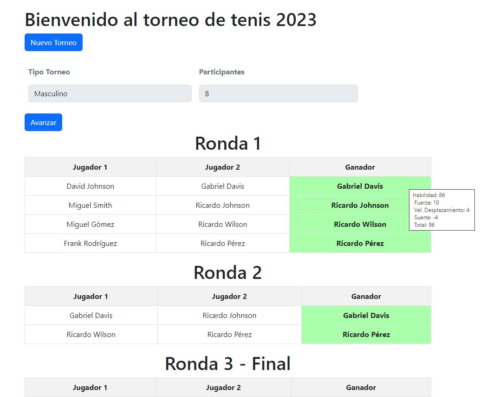
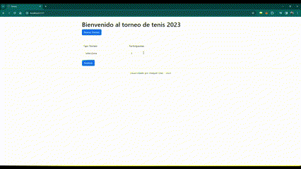

# Modelado de un torneo de tenis

## Descripción

Este proyecto genera una grilla de un torneo de tenis por rondas de eliminación directa sin empates, partiendo de 2 inputs que definen ciertos valores en el torneo.

-   Genero del torneo: Se refiere al sexo que tendran los participantes masculino o femenino.
-   Cantidad de participantes: Este valor permite solamente potencias de 2, lo que realiza un torneo con grupos equitativos.

Una vez generada la creación del proyecto automaticamente se generan los participantes, con nombres y habilidades armadas al azar donde solamente la suerte (Luck) sera un atributo que podra ser negativo.

Los enfrentamientos se miden segun la suma total de habilidade de los participantes, teniendo cada genero una suma distinta.

-   Masculino: Habilidad + Fuerza + Velocidad desplazamiento + Suerte.
-   Femenino: Habilidad + Velocidad de reacción + Suerte.

## Captures

## Futuros / Pendiente

-   La intención es que utilizar la clase Tournament para crear una instancia que se pueda enviar en un JSON y sea recibida, reguardado en una BD.

## Requisitos

-   PHP >= 7.4 | usado: PHP 8.2.13 (cli)
-   Composer

## About Laravel

Laravel is a web application framework with expressive, elegant syntax. We believe development must be an enjoyable and creative experience to be truly fulfilling. Laravel takes the pain out of development by easing common tasks used in many web projects, such as:

Laravel is accessible, powerful, and provides tools required for large, robust applications.

## License

The Laravel framework is open-sourced software licensed under the [MIT license](https://opensource.org/licenses/MIT).
